# Orbit — Technical Architecture

> Audience: engineers and architects integrating with, operating, or extending
> Orbit. This document describes the system at the component and data-flow level,
> the cross-cutting concerns (security, isolation, observability, persistence),
> deployment topologies, and the deliberate trade-offs. For task-oriented usage
> see the [user guide](./user-guide.md) and [integration guide](./integration/README.md);
> for the wire format see [`../API.md`](../API.md).

## 1. Architectural overview

Orbit is a **local-first agent-operations platform**. It puts a controlled,
observable, policy-governed layer between a caller (a human at the console or an
external application) and one or more **agent harnesses** (CLI coding agents such
as `pi`, or remote/containerised runtimes) that actually execute work.

Three design tenets shape everything below:

1. **The backend is the trust boundary.** Sessions, policy, metrics, secrets, and
   tenancy live server-side. Harnesses are treated as untrusted executors; the
   real LLM key and secret values never enter them except through controlled
   channels.
2. **Isolation is layered, not binary.** Per-session filesystem workspaces, a
   capability×mode policy matrix, a consent-proof hard blocklist, an optional
   container sandbox, and per-tenant scoping compose into defence in depth.
3. **Local-first, but production-shaped.** Zero-config on a laptop (SQLite,
   loopback, dev-mode auth), yet the same code runs multi-tenant on Postgres
   behind a proxy with RBAC and SSO.

### 1.1 System context

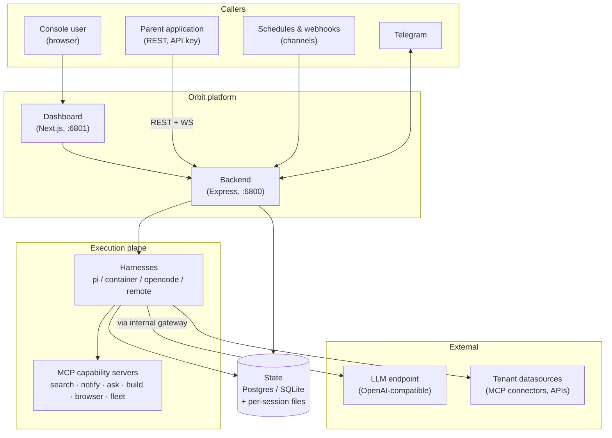

The dashboard is a thin client; **all authority is in the backend**. External
apps skip the dashboard entirely and speak REST/WebSocket to the backend.

## 2. Component model

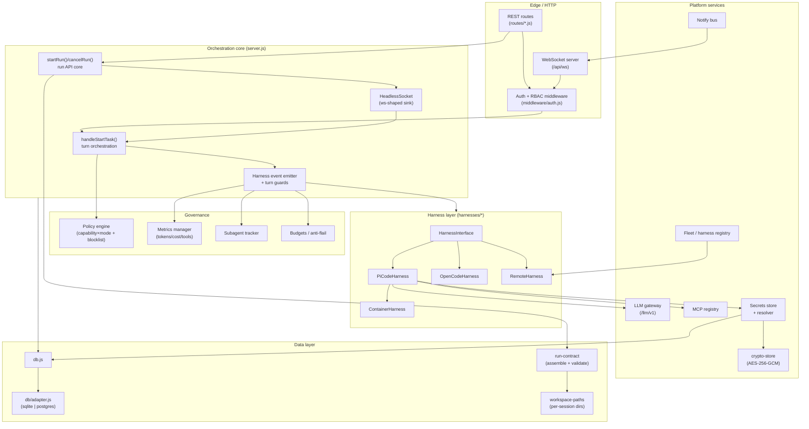

### 2.1 Responsibilities

| Component | Responsibility |
|---|---|
| **REST routes** (`routes/*.js`) | Stateless HTTP surface: sessions, runs, secrets, connectors, profiles, prompts, skills, channels, admin, auth/SSO, workspace files, health. |
| **WebSocket server** (`ws/`) | Interactive, bidirectional session stream (tokens, tool events, plan/usage updates, HITL approvals). |
| **Auth + RBAC** (`middleware/auth.js`) | Resolves a credential → `{ role, tenantId, … }`; enforces role guards; fails closed. |
| **Orchestration core** (`server.js`) | `handleStartTask` (one turn) and `startRun`/`cancelRun` (the run API); owns the harness lifecycle and the per-turn event emitter. |
| **HeadlessSocket** (`ws/headless-socket.js`) | A `ws`-shaped sink so a run with no browser attached reuses the exact same orchestration path; reconstructs + persists the transcript. |
| **Policy engine** (`policy-engine.js`) | Evaluates every tool call against the capability×mode matrix + hard blocklist + command tokenization. |
| **Metrics / subagent tracker** | Provider-reported tokens, directional cost, per-turn ledger, per-sub-agent attribution. |
| **Harness layer** (`harnesses/*`) | One `HarnessInterface`; `PiCodeHarness` is the base, `ContainerHarness` extends it (only the spawn is wrapped), `RemoteHarness` proxies to a paired device. |
| **LLM gateway** (`llm-gateway.js`) | Internal `/llm/v1`; holds the upstream key server-side and issues an app-local key to agents. |
| **MCP registry** (`mcp-registry.js`) | Source of truth for shared MCP servers + backend-side clients for status/tools. |
| **Secrets store + resolver** | Tenant-scoped, encrypted-at-rest credentials; resolves `${secret:NAME}` and injects env at spawn. |
| **Data layer** (`db.js` + `db/adapter.js`) | Dialect-agnostic async persistence over SQLite or Postgres. |
| **run-contract** (`run-contract.js`) | Assembles + schema-validates the result contract; snapshots per-run artifacts. |
| **workspace-paths** | Per-session `~/.orbit/sessions/<id>/{workspace,artifacts,tmp}` isolation. |

### 2.2 The harness abstraction

Every runtime implements one interface, so the orchestration core is
runtime-agnostic. `ContainerHarness` is the strongest illustration of the design:
it inherits `PiCodeHarness` wholesale and overrides **only** `_buildSpawnCommand`
to wrap the process in `docker run`.

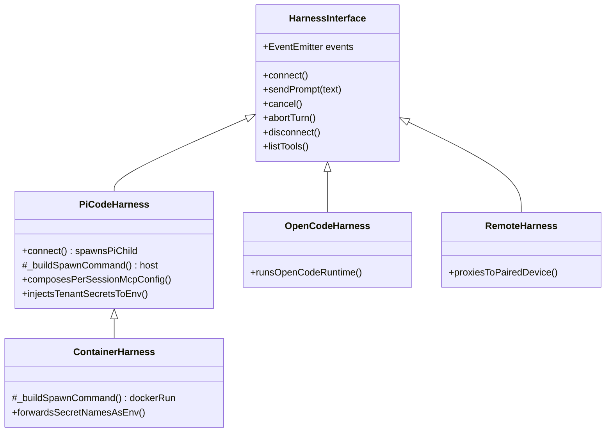

## 3. Key runtime flows

### 3.1 Interactive turn (console)

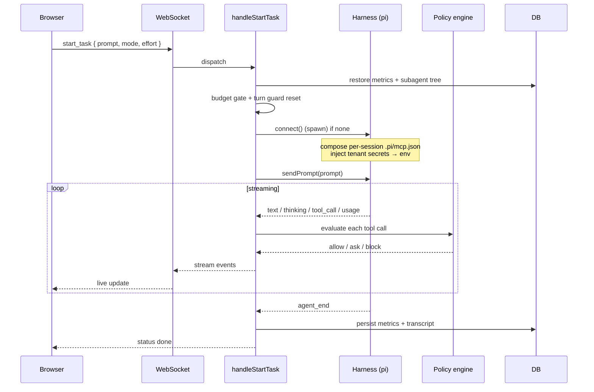

### 3.2 Headless run (Run API) — the parent-app path

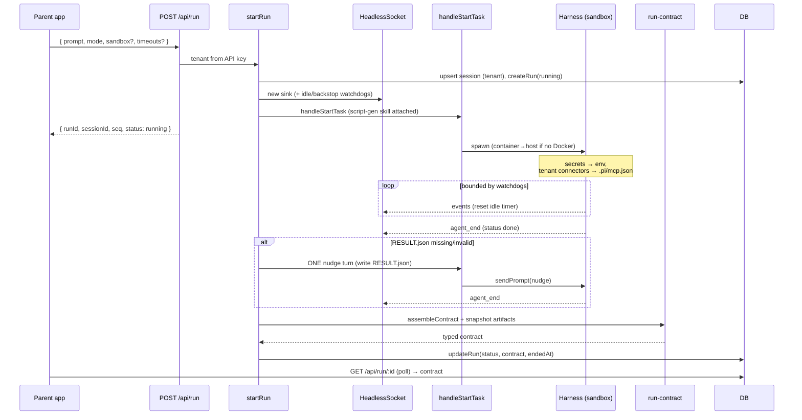

Two properties make this robust:

- **Same code path as the UI.** `HeadlessSocket` is a `ws`-shaped object, so a
  headless run reuses `handleStartTask` unchanged — no divergent "batch" engine.
- **Always terminal.** The idle watchdog + absolute backstop + the
  container→host downgrade guarantee a terminal contract even on a hang or a
  missing Docker daemon.

### 3.3 Run lifecycle (state machine)

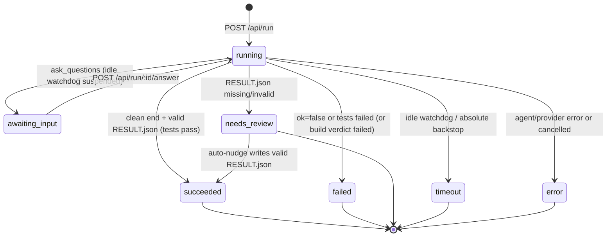

## 4. Data architecture

### 4.1 Dual-driver persistence

The entire app talks to one async contract (`db/adapter.js`):
`run / get / all / exec / tx`. SQL uses `?` placeholders; the Postgres adapter
rewrites them to `$1..$n`. Only genuinely dialect-specific SQL (PRAGMA vs
`information_schema`, `INTEGER`→`BIGINT`) branches on `q.dialect`. This is what
lets the same `db.js` run on `node:sqlite` (zero-config local) and Postgres
(Docker/multi-writer) with identical behavior.

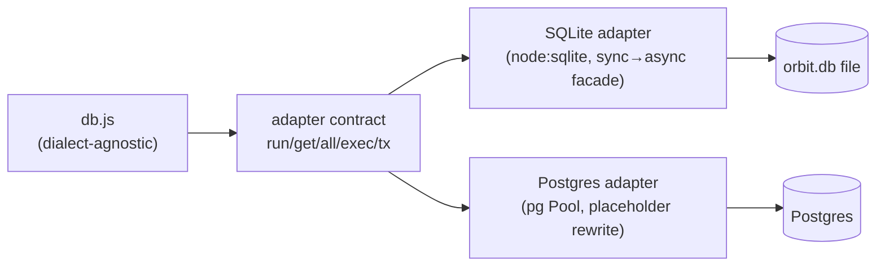

### 4.2 Core entities (schema v19)

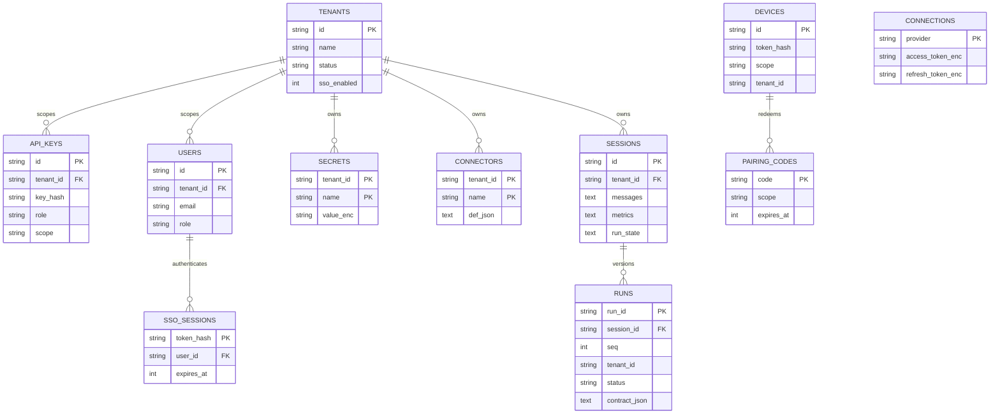

Notable modeling choices:

- **`runs : sessions = many : 1`** with a monotonic `seq` — runs are versioned; a
  session is the durable context, a run is one execution against it.
- **`secrets` / `connectors` / `templates`** use a composite `(tenant_id, name|id)`
  PK with `tenant_id=''` as the "no-tenant/dev" bucket, keeping the key NULL-free
  across both dialects. (`templates` — the tenant output-constraint layer — is the
  v19 addition, following this same pattern.)
- **Encrypted columns** (`*_enc`, `value_enc`) store only ciphertext; the crypto
  boundary is the caller (route/harness) via `crypto-store`, never the DB layer.
- **Tokens are hashed, not encrypted**, where they're only ever compared
  (`key_hash`, `token_hash`); they're encrypted only where they must be replayed
  (service `connections`).

### 4.3 Filesystem state (per-session)

```
<ORBIT_HOME>/sessions/<sessionId>/
  workspace/                 agent cwd (task work, generated scripts)
  artifacts/                 deliverables → surfaced in the result contract
  tmp/                       scratch
  runs/<runId>/artifacts/    immutable per-run snapshot (version history)
  .pi/mcp.json               composed per-session: shared + tenant connectors
```

Two authority-carrying files are generated **per spawn**: the system prompt
(machine-specific workspace block) and `.pi/mcp.json` (the tenant's connector
set with `${secret:}` resolved). This is the mechanism behind tenant-scoped MCP
isolation — the agent only ever sees its own tenant's file.

## 5. Security architecture

Security is layered; no single control is load-bearing.

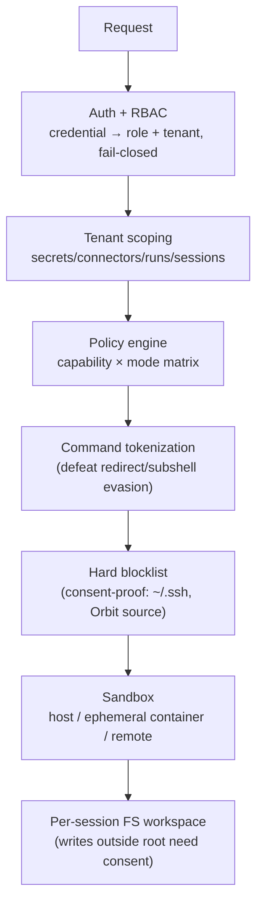

Additional controls:

- **Secret hygiene.** Values are injected into the sandbox env at spawn and
  referenced as `${secret:NAME}`. They never enter the prompt, transcript, or
  logs; reserved env names are protected from being hijacked by a secret.
- **LLM key isolation.** Local agents authenticate to the internal `/llm/v1`
  gateway with an app-local key; the real upstream key stays in the backend and
  is scrubbed from the child env.
- **Encryption at rest.** AES-256-GCM (`crypto-store`) for secrets + replayable
  service tokens, keyed by `ORBIT_SECRET` (or a persisted generated key).
- **Fail-closed auth.** A DB error during authentication returns 500, never an
  implicit allow. Dev-mode (superadmin-for-all) is only reachable when *no*
  superadmin key is configured and is loopback-only.

### 5.1 Tenant isolation boundary

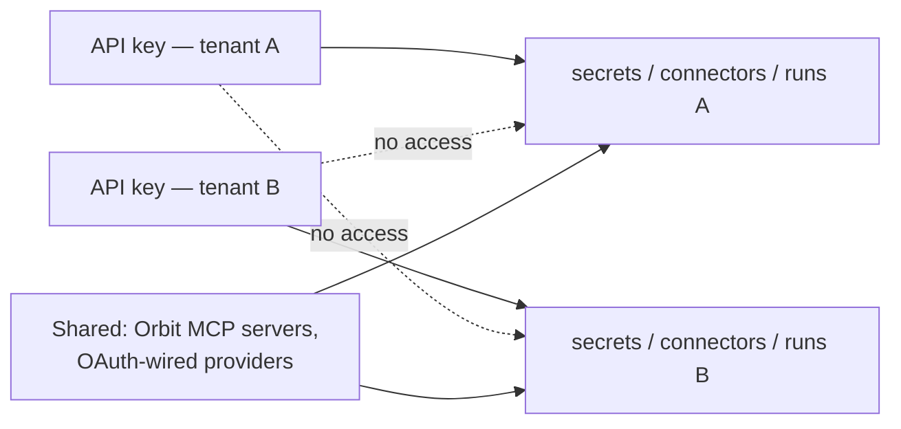

The isolation unit is **the tenant of the API key** that created the resource.
Superadmin operates in the shared (`null`) bucket. Known residual sharing:
OAuth-wired provider connectors live in the global config (per-deployment), and
remote harnesses run with their own `.pi` outside this composition.

## 6. Deployment topologies

### 6.1 Local (dev)

Single Node process, SQLite, loopback, dev-mode auth. `npm run dev` runs the
backend (:6800) + dashboard (:6801). Zero external dependencies beyond an LLM
endpoint and (optionally) `pi`.

### 6.2 Docker Compose (production-shaped)

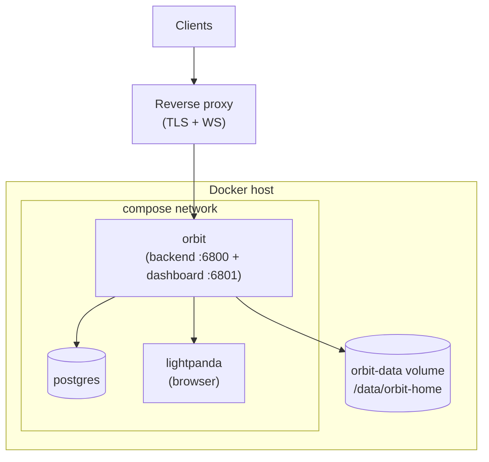

Notes for operators:

- Source is **baked into `orbit:latest`** (only `/data` is a volume) — rebuild to
  ship code changes.
- The default sandbox is `host` inside the orbit container unless a Docker socket
  is mounted; for true per-run container isolation, mount
  `/var/run/docker.sock` into the orbit service (docker-out-of-docker).
- Put TLS + WebSocket upgrade at the proxy; set `ORBIT_PUBLIC_ORIGIN` when behind
  chained proxies. See the reverse-proxy recipes in the [README](../README.md#reverse-proxy-tls--websocket-harness).

### 6.3 Distributed (Fleet)

A backend can drive **remote harnesses** — paired devices running an
`orbit-adapter` — over WebSocket. Delegated work streams back into the lead
session's Trace. Remotes are uncontained by design (they run on their own box
with their own `.pi`), which is why tenant-scoped MCP/secret composition does not
extend to them.

## 7. Cross-cutting concerns

| Concern | How it's addressed |
|---|---|
| **Observability** | Provider-reported tokens (not estimates) + directional cost, per-turn ledger, per-sub-agent attribution, tenant-bucketed admin observability. Persisted no-clobber so a refresh never zeroes live numbers. |
| **Resilience** | Runs are event-driven with idle + absolute watchdogs; interrupted turns are marked resumable via `run_state`; harness process groups are signalled so in-flight shell children die on cancel. |
| **Back-pressure / cost control** | Per-session budgets (cost/token/sub-agent-depth) gate a turn *before* spend; anti-flail turn guards halt unproductive loops. |
| **Portability** | Dual DB driver; local vs container vs remote sandbox behind one flag; the same orchestration path for UI and headless. |
| **Extensibility** | New capabilities are MCP servers; new runtimes implement `HarnessInterface`; prompts/skills/profiles are data, editable via API. |

## 8. Deliberate trade-offs & known limits

- **Backend is a single writer of orchestration state.** Horizontal scale-out of
  concurrent *interactive* sessions is bounded by one process; Postgres enables
  multi-writer data but the run/session orchestration is process-local
  (`activeSessions`, `activeRuns` maps). Scale today is vertical + Fleet
  fan-out, not multi-node orchestration.
- **Per-execution (per-bash) timeout** is not enforced at the run-manager layer;
  the idle watchdog + backstop cover hangs. True per-command timeouts are a
  harness-level concern.
- **Container sandbox caveats.** Host-absolute stdio MCP `command` paths may not
  resolve inside the container (HTTP-url MCPs are fine); nested Docker requires a
  mounted socket.
- **Result contract depends on agent cooperation** for the self-reported test
  block. The schema validator + one auto-nudge mitigate this; a persistently
  non-compliant model yields `needs_review` (never a false `succeeded`) — a
  deliberate safety bias.
- **OAuth-wired connectors are effectively deployment-shared**, not per-tenant.

## 9. Where things live (source map)

| Area | Path |
|---|---|
| HTTP + WS entry, orchestration, run API | `agent-backend/server.js`, `agent-backend/ws/` |
| REST routes | `agent-backend/routes/*.js` |
| Auth / RBAC | `agent-backend/middleware/auth.js` |
| Harnesses | `agent-backend/harnesses/{picode,container,opencode,remote}` |
| Policy / metrics / subagents | `agent-backend/{policy-engine,metrics,subagent-tracker}.js` |
| Secrets / crypto / resolver | `agent-backend/{crypto-store,secrets-resolver}.js`, `routes/secrets.js` |
| Run contract | `agent-backend/run-contract.js` |
| Data layer | `agent-backend/db.js`, `agent-backend/db/adapter.js` |
| MCP registry + servers | `agent-backend/mcp-registry.js`, `mcp-servers/`, `agent-backend/mcp/` |
| Per-session FS | `agent-backend/workspace-paths.js` |
| Prompts / skills | `prompts/`, `skills/` |
| Dashboard | `dashboard/` (Next.js) |

---

*See also: [Concepts](./concepts.md) for definitions, [Integration guide](./integration/README.md)
for the API contract, [Configuration](./configuration.md) for the operational knobs.*
